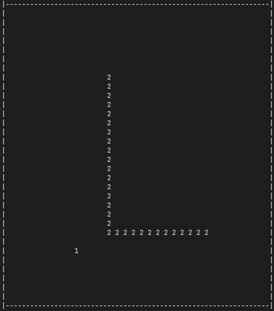
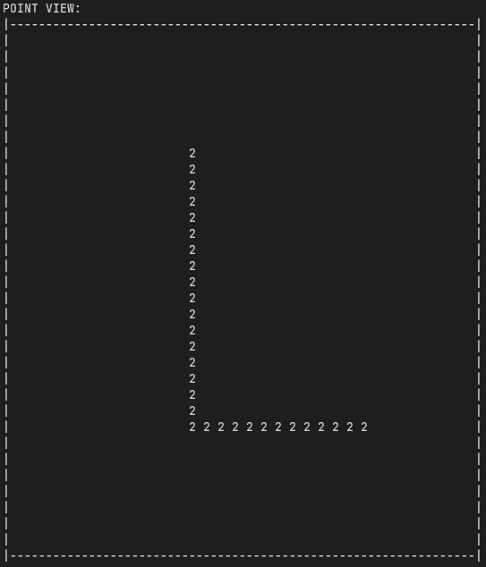
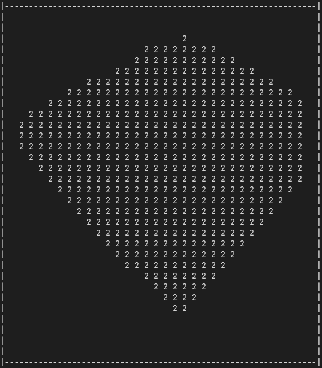

# cli_rendering

Building a DOOM style image rendering in the command line


## How to use
```bash
# Compile
clang src/main.c -o render -lm 

# Run
./render <width> <height> <view_direnction>

```

NOTE: view_direction is in degrees

## Showcase

SETUP: Two walls corner render, FOV 90, ANGLE 45

Map:
<br>

Camera view:
<br>

Actual render:
<br>


